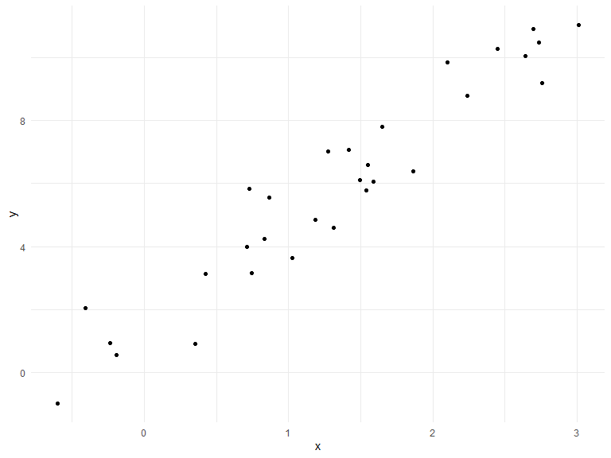

Writting Functions
================
Kristal Quispe
11/3/2019

## Get started

We’re going to write some functions.

Here’s z scores

``` r
x = rnorm(n = 30, mean = 4, sd = 2.3)
x_again = rnorm(n = 30, mean = 6, sd = .3) 
y = rnorm(n = 30, mean = 24, sd = 2.3)
(x - mean(x)) / sd(x)
```

    ##  [1] -0.69911486 -0.91897156  0.67260733  0.42783021  1.26911507
    ##  [6]  0.07324386 -0.43358579 -2.08526677 -0.42674523  0.10334610
    ## [11] -0.33898998  0.15082755  0.29869164  1.22648347  2.00699408
    ## [16]  0.64586934  0.08690872 -1.02875818  0.31823663 -1.15452493
    ## [21]  0.99803571 -0.09629102  0.79844850  0.22517841 -0.76820697
    ## [26]  2.21644094 -0.11122873 -1.68646045 -0.44333384 -1.32677925

``` r
(x_again - mean(x_again)) / sd(x_again)
```

    ##  [1] -1.42329381 -0.26926107  0.50220173 -1.55532210  1.55045165
    ##  [6] -0.21596679  0.68986177  0.69671053  1.71593497  0.26252200
    ## [11]  0.38697990  0.25922192  0.40898233  0.55082856 -0.46590592
    ## [16]  0.13660932 -1.07314829 -0.64222546  0.91105083  0.76332265
    ## [21] -1.28295368  0.05438016 -1.66934168 -0.34555584 -2.35968378
    ## [26]  0.19405135  0.48655953  0.69396976  1.63446304 -0.59544357

Now a function.

``` r
z_score = function(x_arg) {
  
  if (!is.numeric(x_arg)) {
    stop("x should be numeric")
  } else if (length(x_arg) < 3) {
    stop("x should be longer than 3")
  } 
  
  (x_arg - mean(x_arg)) / sd(x_arg)
  
}
```

Try out the function.

``` r
z_score(x_arg = y)
```

    ##  [1] -1.22753185  0.28215483 -1.29791790  0.33066216 -0.34810877
    ##  [6] -0.04791252 -0.71254516 -0.10538110  0.08289079  1.59315139
    ## [11] -0.96171042 -0.18508860 -0.29182978  1.47861814 -0.01699077
    ## [16] -0.92983190  1.51835181 -2.42581242 -0.77949012  0.90157113
    ## [21]  0.47384868  1.73151160  0.92295569 -1.36436599  0.85172373
    ## [26]  1.18099164  0.47625166 -0.32295688 -0.32193218 -0.48527688

``` r
z_score(x_arg = 3) #you cant calcualte a sd for a single number
```

    ## Error in z_score(x_arg = 3): x should be longer than 3

``` r
z_score(x_arg = "my name is jeff") # you will get an error saying you cant calculate the mean or SD of a charecter varible
```

    ## Error in z_score(x_arg = "my name is jeff"): x should be numeric

``` r
z_score(x_arg = c(TRUE, TRUE, FALSE, TRUE)) #this works b/c r converts true to 1 and false to 0 (numeric) from where it will take the mean and SD. 
```

    ## Error in z_score(x_arg = c(TRUE, TRUE, FALSE, TRUE)): x should be numeric

``` r
z_score(x_arg = iris) #IRIS IS A DATA FRAME (I.E MULTIPLE ROWS AND COLUMNS, SO R REPLIES WITH ERROR, you can t find the mean and SD for all varibels within a DF, you can only do it per variable. )
```

    ## Error in z_score(x_arg = iris): x should be numeric

``` r
#r markdown will stop knitting if the function  
```

## Multiple outputs

``` r
mean_and_sd = function(input_x) {
  
  if (!is.numeric(input_x)) {
    stop("x should be numeric")
  } else if (length(input_x) < 3) {
    stop("x should be longer than 3")
  } 
  
  list(
    mean_input = mean(input_x),
    sd_input = sd(input_x),
    z_score = (input_x - mean(input_x)) / sd(input_x)
  ) #instead of list(), you can use tibble()
  
}
```

test this function

``` r
mean_and_sd(input_x = y)
```

    ## $mean_input
    ## [1] 24.04081
    ## 
    ## $sd_input
    ## [1] 2.471225
    ## 
    ## $z_score
    ##  [1] -1.22753185  0.28215483 -1.29791790  0.33066216 -0.34810877
    ##  [6] -0.04791252 -0.71254516 -0.10538110  0.08289079  1.59315139
    ## [11] -0.96171042 -0.18508860 -0.29182978  1.47861814 -0.01699077
    ## [16] -0.92983190  1.51835181 -2.42581242 -0.77949012  0.90157113
    ## [21]  0.47384868  1.73151160  0.92295569 -1.36436599  0.85172373
    ## [26]  1.18099164  0.47625166 -0.32295688 -0.32193218 -0.48527688

## Multiple inputs

``` r
sim_data = tibble(
  x = rnorm(30, mean = 1, sd = 1),
  y = 2 + 3 * x + rnorm(30, 0, 1)
)
sim_data %>% 
  ggplot(aes(x = x, y = y)) + 
  geom_point()
```



``` r
ls_fit = lm(y ~ x, data = sim_data) # here you are fitting a regression of y on x, using the sim date frame
  
beta0_hat = coef(ls_fit)[1] #this will give you estimated intercept
beta1_hat = coef(ls_fit)[2] #this will give you estimated slope
```

``` r
sim_regression = function(n, beta0 = 2, beta1 = 3) {
  #here you have assiged a default value of 2 for the intercept, and 3 for the slope
  sim_data = tibble(
    x = rnorm(n, mean = 1, sd = 1),
    y = beta0 + beta1 * x + rnorm(n, 0, 1)
  )
  
  ls_fit = lm(y ~ x, data = sim_data)
  
  tibble(
    beta0_hat = coef(ls_fit)[1],
    beta1_hat = coef(ls_fit)[2]
  )
  
}
sim_regression(n = 3000, beta0 = 17, beta1 = -3)
```

    ## # A tibble: 1 x 2
    ##   beta0_hat beta1_hat
    ##       <dbl>     <dbl>
    ## 1      17.0     -3.03

``` r
sim_regression(n = 14, beta0 = 24)
```

    ## # A tibble: 1 x 2
    ##   beta0_hat beta1_hat
    ##       <dbl>     <dbl>
    ## 1      24.5      2.60

## Scrape lots of napoleon

``` r
url = "https://www.amazon.com/product-reviews/B00005JNBQ/ref=cm_cr_arp_d_viewopt_rvwer?ie=UTF8&reviewerType=avp_only_reviews&sortBy=recent&pageNumber=1"
dynamite_html = read_html(url)
review_titles = 
  dynamite_html %>%
  html_nodes("#cm_cr-review_list .review-title") %>%
  html_text()
review_stars = 
  dynamite_html %>%
  html_nodes("#cm_cr-review_list .review-rating") %>%
  html_text()
review_text = 
  dynamite_html %>%
  html_nodes(".review-text-content span") %>%
  html_text()
reviews = tibble(
  title = review_titles,
  stars = review_stars,
  text = review_text
)

#to get all the info (title, stars, and text) from page 2 or page 3 you change the last number on the URL to the new number page and copy and paste code over and over again
```

Now as a function

``` r
read_page_reviews = function(page_url) {
  
  dynamite_html = read_html(page_url)
  review_titles = 
    dynamite_html %>%
    html_nodes("#cm_cr-review_list .review-title") %>%
    html_text()
  review_stars = 
    dynamite_html %>%
    html_nodes("#cm_cr-review_list .review-rating") %>%
    html_text()
  
  review_text = 
    dynamite_html %>%
    html_nodes(".review-text-content span") %>%
    html_text()
  
  reviews = tibble(
    title = review_titles,
    stars = review_stars,
    text = review_text
  )
  
  reviews #this is the output
    
}
```

Now i can read a lot of page reviews\! Although I’m back to
copy-and-pasting code
…

``` r
read_page_reviews("https://www.amazon.com/product-reviews/B00005JNBQ/ref=cm_cr_arp_d_viewopt_rvwer?ie=UTF8&reviewerType=avp_only_reviews&sortBy=recent&pageNumber=1")
```

    ## # A tibble: 10 x 3
    ##    title                   stars       text                                
    ##    <chr>                   <chr>       <chr>                               
    ##  1 "Awesome\n            " 5.0 out of~ Favorite movie of all time          
    ##  2 "Gotta watch it!\n    ~ 5.0 out of~ Super fun cult film. A must-see! Fu~
    ##  3 "Great movie\n        ~ 5.0 out of~ Love this movie.                    
    ##  4 "Duh\n            "     5.0 out of~ Best movie ever                     
    ##  5 "Great video\n        ~ 5.0 out of~ Product as described.  Great transa~
    ##  6 "Give me some of your ~ 5.0 out of~ This movie will always be my favori~
    ##  7 "Nostalgic\n          ~ 5.0 out of~ One of the best nostalgic movies of~
    ##  8 "Make you giggle type ~ 5.0 out of~ "I love, love, love this movie.  It~
    ##  9 "This movie is so stup~ 5.0 out of~ No, really.  It's so stupid.  Your ~
    ## 10 "Hilarious\n          ~ 5.0 out of~ Hilarious

``` r
read_page_reviews("https://www.amazon.com/product-reviews/B00005JNBQ/ref=cm_cr_arp_d_viewopt_rvwer?ie=UTF8&reviewerType=avp_only_reviews&sortBy=recent&pageNumber=2")
```

    ## # A tibble: 10 x 3
    ##    title                       stars      text                             
    ##    <chr>                       <chr>      <chr>                            
    ##  1 "Waste of money\n         ~ 1.0 out o~ Terrible movie! Please don’t was~
    ##  2 "Good movie\n            "  5.0 out o~ Funny                            
    ##  3 "A classic\n            "   5.0 out o~ I like your sleeves. They're rea~
    ##  4 "FRIKKEN SWEET MOVIE, GAWS~ 5.0 out o~ It’s Napolean Dynamite. It’s cha~
    ##  5 "You gonna eat the rest of~ 5.0 out o~ One of my favorite movies ever. ~
    ##  6 "Tina you fat lard come ge~ 5.0 out o~ It's a great movie               
    ##  7 "Great family movie\n     ~ 5.0 out o~ My kids as well as the adults lo~
    ##  8 "Teens love it\n          ~ 5.0 out o~ Original and funny               
    ##  9 "Great\n            "       5.0 out o~ Funny                            
    ## 10 "Great Movie, Bad Packagin~ 4.0 out o~ First off, the stick-on label on~

``` r
read_page_reviews("https://www.amazon.com/product-reviews/B00005JNBQ/ref=cm_cr_arp_d_viewopt_rvwer?ie=UTF8&reviewerType=avp_only_reviews&sortBy=recent&pageNumber=3")
```

    ## # A tibble: 10 x 3
    ##    title                     stars       text                              
    ##    <chr>                     <chr>       <chr>                             
    ##  1 "jeez napoleon\n        ~ 5.0 out of~ gosh                              
    ##  2 "\U0001f44d\n           ~ 5.0 out of~ "\U0001f44d"                      
    ##  3 "A classic!\n           ~ 5.0 out of~ A classic movie.  Hilarious!      
    ##  4 "A must own\n           ~ 5.0 out of~ Great movie                       
    ##  5 "If you like 80s ...you ~ 5.0 out of~ My all time favorite movie. I hav~
    ##  6 "\U0001f918\n           ~ 5.0 out of~ "\U0001f918"                      
    ##  7 "Super Slow Mooovie...\n~ 1.0 out of~ "Too slow and too damn quiet... M~
    ##  8 "Awesome!\n            "  5.0 out of~ Love this movie !                 
    ##  9 "Very funny\n           ~ 4.0 out of~ Very funny                        
    ## 10 "Eat your food tina\n   ~ 5.0 out of~ Cant go wrong

``` r
read_page_reviews("https://www.amazon.com/product-reviews/B00005JNBQ/ref=cm_cr_arp_d_viewopt_rvwer?ie=UTF8&reviewerType=avp_only_reviews&sortBy=recent&pageNumber=4")
```

    ## # A tibble: 10 x 3
    ##    title                         stars      text                           
    ##    <chr>                         <chr>      <chr>                          
    ##  1 "Dumb funny\n            "    5.0 out o~ Dumb funny                     
    ##  2 "Annoying! Not in a good way~ 1.0 out o~ I know that I am one of the ve~
    ##  3 "Fun\n            "           5.0 out o~ Fun                            
    ##  4 "such a great movie\n       ~ 5.0 out o~ a true comedy classic          
    ##  5 "Napoleon Dud\n            "  3.0 out o~ Not impressed w/movie.         
    ##  6 "Five stars\n            "    5.0 out o~ Such a weird, awesome movie    
    ##  7 "Fun!\n            "          5.0 out o~ Great movie                    
    ##  8 "Funny movie- bravo for Amaz~ 5.0 out o~ My son loves this movie, so I ~
    ##  9 "Movie\n            "         5.0 out o~ Movie                          
    ## 10 "Funny movie, quotable lines~ 5.0 out o~ My kids quote this movie all t~

## Scoping

Mean example …

``` r
f = function(x) {
  z = x + y
  z
}
x = 1
y = 2
f(x = 2)
```

    ## [1] 4

``` r
#the answer is 4
```
